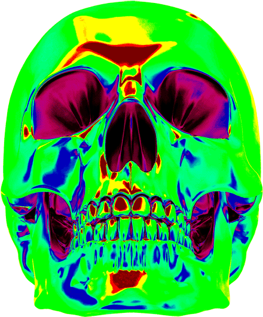

```zsh
> macchina
```

 

```csharp
aresociety@github
----------------

    OS : windows11 arm64
    Shell: zsh 5.9
    Terminal: Terminus
    CPU : intel i5 9900kf
    Languages: Python, Node.js, PHP
    Discord: 581470718387159040
    mailto: aesthetic@gtfcy37qyzor7kb6blz2buwuu5u7qjkycasjdf3yaslibkbyhsxub4yd.onion
```

<p align="left">
  &nbsp; &nbsp; &nbsp; &nbsp; &nbsp;&nbsp; &nbsp; &nbsp; &nbsp; &nbsp;&nbsp; &nbsp; &nbsp; &nbsp; &nbsp; &nbsp; &nbsp; &nbsp; &nbsp; &nbsp; &nbsp;&nbsp; &nbsp; &nbsp; &nbsp; &nbsp;&nbsp; &nbsp; &nbsp; &nbsp; &nbsp;
  
  
  
  
  
</p>
